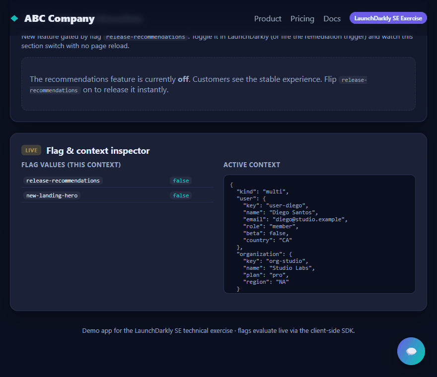
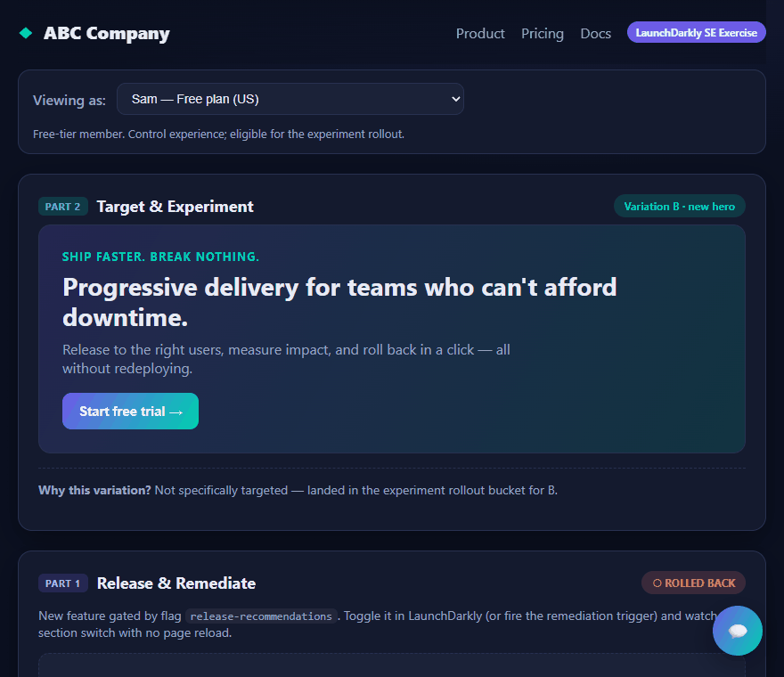
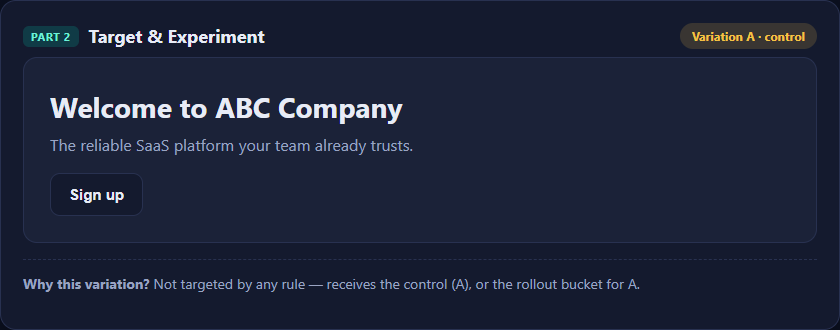
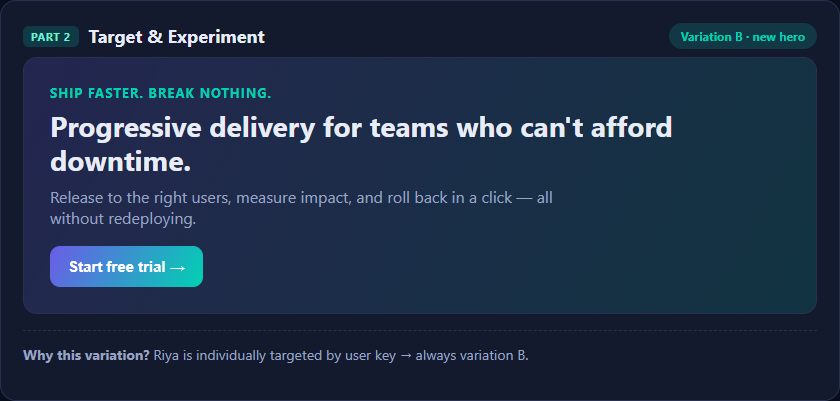
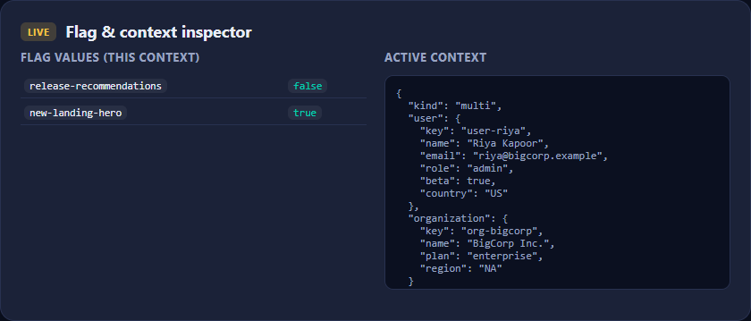

# ABC Company — LaunchDarkly SE Technical Exercise

A small but realistic **React + Node** SaaS landing page that demonstrates the
full LaunchDarkly progressive‑delivery workflow:

| Exercise part | What it shows | Where it lives |
| --- | --- | --- |
| **Part 1 — Release & Remediate** | A new feature behind a flag, a **real‑time listener** that flips the UI with **no page reload**, and a **trigger** that kills the feature via `curl`. | `client/src/components/Part1Recommendations.jsx`, `ChangeToast.jsx` |
| **Part 2 — Target** | A flagged landing component, a **multi‑context** with custom attributes, and **individual + rule‑based** targeting. | `client/src/components/Part2Hero.jsx`, `client/src/lib/personas.js` |
| **Extra credit — Experimentation** | A **metric** + an **experiment** on the targeting flag, with a traffic generator to populate data. | `scripts/generate-traffic.mjs` |
| **Extra credit — AI Configs** | A chatbot whose **model + prompt are controlled from LaunchDarkly** (no redeploy). | `server/ai.js`, `client/src/components/ChatWidget.jsx` |

Everything LaunchDarkly needs — flags, targeting, the metric, and the
remediation trigger — is created for you by a single **idempotent bootstrap
script** (`npm run bootstrap`) that talks to the LaunchDarkly REST API. No
manual clicking required to get the core demo running.

---

## Demo

### Part 1 — Release & Remediate (instant, no page reload)

Toggling the flag in LaunchDarkly streams straight to the browser: the feature
appears, a **“flag changed live” toast** fires from the explicit `on('change')`
listener, and firing the remediation trigger rolls it back — all with **no page
reload**.



### Part 2 — Targeting (individual + rule-based)

Switching the active persona re-`identify()`s the SDK, so every flag re-evaluates
live. Targeted users (individual key / enterprise / beta) get the new hero;
everyone else falls into the experiment split — and the app explains *why* for
each persona.



| Control · Variation A (not targeted) | Treatment · Variation B (targeted) |
| :---: | :---: |
|  |  |

### Live flag &amp; context inspector

A built-in panel shows exactly what the SDK returns for the active context.



---

## 1. Architecture

```
 Browser (Vite + React, :5173)                 Node/Express (:3001)
 ┌───────────────────────────────┐             ┌──────────────────────────────┐
 │ launchdarkly-react-client-sdk │  stream     │ @launchdarkly/node-server-sdk│
 │  • useFlags() live values     │◀───────────▶│  • AI Configs evaluation     │
 │  • ldClient.on('change') ⚡    │  LaunchDarkly│  • experiment traffic        │
 │  • ldClient.identify(persona) │   flag CDN  │ @launchdarkly/server-sdk-ai  │
 │  • ldClient.track(metric)     │             │  + Anthropic API (chatbot)   │
 └───────────────┬───────────────┘             └──────────────┬───────────────┘
                 │  /api/chat  (Vite proxy)                    │
                 └─────────────────────────────────────────────┘
```

- The **browser** uses the public **client‑side ID** and a streaming connection,
  so flag changes show up instantly (Parts 1 & 2).
- The **server** uses the secret **server SDK key** for the AI Configs chatbot
  and for generating experiment traffic.

---

## 2. Prerequisites & assumptions

The setup assumes:

- **Node.js ≥ 18** and npm (developed on Node 24 / npm 11). Check: `node -v`.
- A **LaunchDarkly account** — start a free trial at
  <https://launchdarkly.com/start-trial/>.
- A **LaunchDarkly API access token** with a **Writer** (or Admin) role:
  *Account settings → Authorization → Create token*. Used only by the scripts.
- An **Anthropic API key** for the AI Configs chatbot (extra credit):
  <https://console.anthropic.com/>. Skip if you don't want the chatbot.
- A terminal on macOS, Linux, or Windows. Commands below use a POSIX shell;
  on Windows, Git Bash or WSL works, or adapt `cp`/`curl` to PowerShell.
- Outbound HTTPS to `app.launchdarkly.com`, `*.launchdarkly.com` (streaming),
  and `api.anthropic.com`.

---

## 3. Quick start (5 steps)

```bash
# 1. Install dependencies (root + client + server workspaces)
npm install

# 2. Create your env file and add your two keys
cp .env.example .env
#    Edit .env and set:
#      LD_API_TOKEN=api-...        (required)
#      ANTHROPIC_API_KEY=sk-ant-... (only for the AI chatbot)
#    Leave LD_SDK_KEY and VITE_LD_CLIENT_ID blank — the next step fills them.

# 3. Create all LaunchDarkly resources + auto-fill the SDK keys
npm run bootstrap

# 4. Start the app (frontend + backend together)
npm run dev

# 5. Open the app
#    http://localhost:5173
```

`npm run bootstrap` is safe to re-run; it skips anything that already exists.
It prints the **remediation trigger URL** (also saved to
`trigger-url.local.txt`) that you'll use in the Part 1 demo.

> **Why a bootstrap script?** It makes the exercise fully reproducible and is
> itself a demonstration of LaunchDarkly's API‑first, "everything as code"
> philosophy. If you'd rather create resources by hand, see
> [Appendix A](#appendix-a--recreating-resources-by-hand).

---

## 4. Demo walkthrough

### Part 1 — Release & Remediate  🚀

1. In the app, find the **"Part 1 · Release & Remediate"** panel. The
   recommendations feature starts **rolled back** (flag off).
2. In LaunchDarkly, open the **`release-recommendations`** flag and toggle
   **targeting ON** (then ensure the default serves `true`). Save.
3. Back in the browser **— without reloading —** the new "Recommended for you"
   widget appears, and a **⚡ "Flag changed live"** toast pops in. That toast is
   driven by an explicit `ldClient.on('change', …)` **listener**
   (`client/src/components/ChangeToast.jsx`).
4. **Remediate (kill switch).** Simulate a bug slipping through: fire the
   remediation **trigger** to turn the flag off instantly, no UI access needed:

   ```bash
   curl -X POST "$(cat trigger-url.local.txt)"
   ```

   The widget disappears in the browser immediately. This is the
   "quickly roll back with minimal customer impact" requirement.

### Part 2 — Target  🎯

1. Use the **"Viewing as"** dropdown at the top to switch personas. Each
   persona is a LaunchDarkly **multi‑context** (`user` + `organization`) with
   attributes like `plan`, `role`, `beta`, `country`
   (`client/src/lib/personas.js`). Switching calls `ldClient.identify(...)`, so
   all flags re‑evaluate live.
2. Watch the **"Part 2 · Target & Experiment"** hero and the **"Why this
   variation?"** line change per persona:
   - **Riya** → *individually targeted* by `user.key = user-riya` → always the
     new hero.
   - **Yuki** → matches the *rule* `organization.plan is "enterprise"` → new hero.
   - **Sam / Diego** → not targeted → control hero (or the experiment rollout).
3. The **Flag & context inspector** panel shows the live flag values and the
   exact context the SDK is evaluating.

### Extra credit — Experimentation  📊

The bootstrap script created the **`hero-cta-click`** metric and the targeting
flag. Now create + start the experiment and feed it data:

```bash
# 1. Create AND start the experiment (50/50 control vs treatment on the
#    fallthrough audience, primary metric = hero-cta-click).
npm run experiment

# 2. Generate traffic so there's data to analyze (the real site sees ~40k/day).
npm run traffic 5000      # simulate 5000 visitors (default 2000)
```

`npm run experiment` builds the whole experiment via the REST API:
hypothesis *"the new hero increases CTA click‑through"*, flag
**`new-landing-hero`**, randomization unit **user**, variations
`true` (treatment) vs `false` (control), metric **`hero-cta-click`**. The
traffic generator fires `hero-cta-click` with the treatment converting a bit
better than control, so the experiment shows a realistic, detectable lift.

Open **Experiments → New landing hero** in LaunchDarkly to watch results
populate (LD processes experiment data on a schedule, so allow a little time).
Run `npm run traffic` again to add more samples until LaunchDarkly reports
statistical significance, then make your ship/no‑ship call.

> Prefer the UI? You can also build the same experiment by hand:
> **Experiments → Create experiment**, flag `new-landing-hero`, metric
> `hero-cta-click`, 50/50 on the fallthrough, then **Start**.

> Clicking the hero CTA in the real UI also fires the metric
> (`ldClient.track('hero-cta-click')`), so you can contribute live conversions too.

### Extra credit — AI Configs  🤖

1. Click the **💬** button (bottom‑right) and chat with the **ABC Assistant**.
2. The server does **not** hard‑code the model or prompt — it reads the
   **`support-chatbot`** AI Config at request time (`server/ai.js`). The chat
   panel shows which `model` answered.
3. Change behavior **with no redeploy**: in LaunchDarkly open the
   `support-chatbot` AI Config and edit the prompt, swap the model
   (e.g. Haiku → Sonnet), or adjust temperature. The next message uses it.
4. *(Optional)* Create an **AI Config experiment** to compare two prompt/model
   variations against a metric (e.g. token cost or user feedback). The tracker
   in `server/ai.js` already reports latency, token usage, and success to LD.

> If your account/plan can't create AI Configs via the API, the bootstrap
> script says so and the chatbot falls back to a sensible built‑in default so
> it still works. See [Appendix B](#appendix-b--ai-config-by-hand) to create it
> in the UI.

---

## 5. Configuration reference (`.env`)

| Variable | Required | Set by | Notes |
| --- | --- | --- | --- |
| `LD_API_TOKEN` | yes | you | Management token (Writer/Admin). Scripts only — never shipped to the browser. |
| `LD_PROJECT_KEY` | yes | you (default `se-exercise`) | Created by bootstrap if missing. |
| `LD_ENV_KEY` | yes | you (default `production`) | Which environment to configure. |
| `LD_SDK_KEY` | yes | **bootstrap** | Secret server SDK key. |
| `VITE_LD_CLIENT_ID` | yes | **bootstrap** | Public client‑side ID for the browser. |
| `LD_AI_CONFIG_KEY` | no | **bootstrap** | Defaults to `support-chatbot`. |
| `ANTHROPIC_API_KEY` | for chatbot | you | Anthropic key (`sk-ant-...`). |
| `PORT` | no | you (default `3001`) | Backend port. |

**Security:** `.env` and `trigger-url.local.txt` are git‑ignored. Only the
**client‑side ID** is exposed to the browser (it's designed to be public). The
**server SDK key** and **API token** stay server‑side.

---

## 6. Project structure

```
launchdarkly-se-exercise/
├── scripts/
│   ├── bootstrap-launchdarkly.mjs   # creates all LD resources via REST API
│   ├── setup-experiment.mjs         # creates + starts the experiment
│   └── generate-traffic.mjs         # simulates visitors for the experiment
├── server/                          # Express backend
│   ├── index.js                     # routes: /api/health, /api/chat
│   ├── ld.js                        # server-side LD client (singleton)
│   ├── ai.js                        # AI Configs chatbot (Anthropic)
│   └── env.js                       # loads the shared root .env
├── client/                          # Vite + React frontend
│   └── src/
│       ├── main.jsx                 # LDProvider (streaming) setup
│       ├── App.jsx                  # layout + persona identify()
│       ├── lib/{flags,metrics,personas}.js
│       └── components/              # Part1, Part2, ChatWidget, ChangeToast, …
├── .env.example
└── README.md
```

---

## 7. Troubleshooting

- **App shows "Setup needed".** `VITE_LD_CLIENT_ID` isn't set. Run
  `npm run bootstrap`, then restart `npm run dev` (Vite reads env at startup).
- **Flags don't change in the browser.** Confirm the flag's *client‑side
  availability* is on (the bootstrap sets `usingEnvironmentId: true`) and that
  you toggled the correct environment (`LD_ENV_KEY`).
- **Chatbot returns an error.** Ensure `ANTHROPIC_API_KEY` is set and the
  server was restarted after editing `.env`. Check `http://localhost:3001/api/health`.
- **Bootstrap fails on the API token.** The token needs write access (Writer or
  Admin). Reader‑only tokens can't create flags.
- **Experiment shows no data.** The experiment must be **started**, and the
  synthetic users must fall into its audience — `npm run traffic` generates
  non‑targeted free/pro users specifically for that.

---

## Appendix A — Recreating resources by hand

If you don't run the bootstrap script, create these in LaunchDarkly manually
(project default `se-exercise`, environment `production`). **All flags must have
"SDK using Client‑side ID" enabled** so the browser can evaluate them.

1. **Flag `release-recommendations`** — boolean (`true`/`false`), default off.
   Client‑side availability: **on**. (Part 1.)
2. **Flag `new-landing-hero`** — boolean (`true`/`false`). Client‑side
   availability: **on**. Targeting (Part 2):
   - **Individual target:** serve `true` to user key `user-riya`.
   - **Rule:** if `organization.plan` is `enterprise` → serve `true`.
   - **Rule:** if `user.beta` is `true` → serve `true`.
   - **Default (fallthrough):** `false` (or a 50/50 rollout for the experiment).
3. **Metric `hero-cta-click`** — custom *conversion* metric, event key
   `hero-cta-click`, unit `user`, success = higher than baseline. (Experiment.)
4. **Trigger** on `release-recommendations` — integration *generic trigger*,
   action **turn flag off**. Copy the generated URL for the `curl` demo. (Part 1.)

Then set `VITE_LD_CLIENT_ID` (environment's client‑side ID) and `LD_SDK_KEY`
(environment's SDK key) in `.env` manually.

## Appendix B — AI Config by hand

Create an AI Config named **`support-chatbot`** with a variation that sets a
model (e.g. `claude-3-5-haiku-latest`) and a system message such as:

> *You are a friendly, concise customer support assistant for {{ companyName }}.
> Answer in 1–3 sentences. If unsure, say so and offer to escalate.*

Turn it on and serve that variation by default. The server reads it via
`LD_AI_CONFIG_KEY`.
